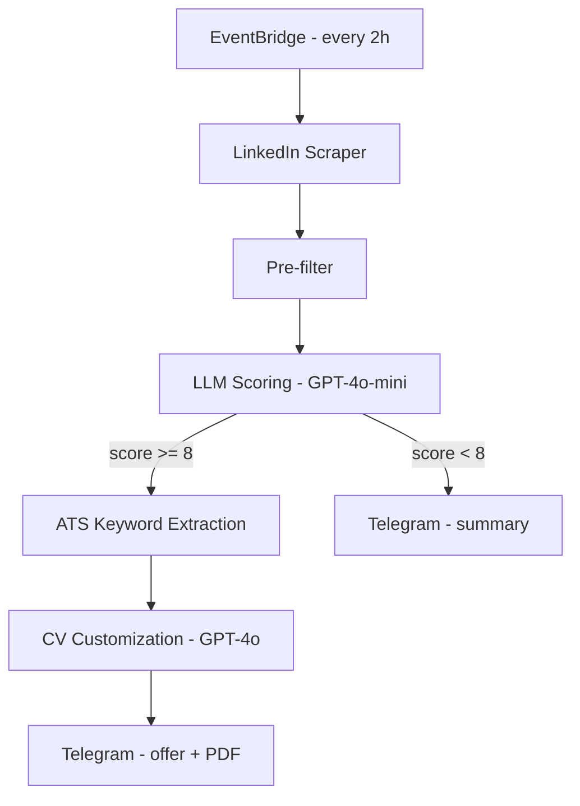

# 🤖 LinkedIn Job Scraper & CV Customizer

> **Automated job search pipeline** — scrapes LinkedIn, ranks offers with an LLM, and delivers a tailored PDF CV directly to your Telegram. Completely serverless. Almost free.

---

## Why This Exists

Sending the same CV to 20 job postings a day yields a ~1% response rate. Manually tailoring each application takes 45+ minutes. This pipeline automates the middle ground: it finds the right offers, scores them against your profile, and generates a personalized CV for each one — while you sleep.

---

## How It Works



### Step by step

| Step | What happens |
|------|-------------|
| **1. Scrape** | Queries LinkedIn's guest API with your role, location, and a smart time range (wider at night, narrower during the day) |
| **2. Parse** | Extracts title, company, location, link, and full job description via BeautifulSoup |
| **3. Pre-filter** | Drops offers containing blacklisted keywords (e.g. "principal", "10+ years") |
| **4. LLM ranking** | GPT-4o-mini reads your CV + profile, scores offers 1–10 with a comment |
| **5. ATS keywords** | Simulates an ATS system to extract technical keywords from each high-score JD |
| **6. CV customization** | Fills 5 DOCX placeholders, converts to PDF via CloudConvert (ConvertAPI as fallback) |
| **7. Telegram delivery** | High-score: offer summary + custom PDF · Low-score: summary list |

---

## Stack

```
Python · LangChain · GPT-4o-mini · AWS Lambda · EventBridge
python-docx · CloudConvert · ConvertAPI · Telegram Bot API
```

---

## Prerequisites

- Python 3.11+
- [Telegram bot token](https://core.telegram.org/bots#botfather) + your chat ID
- [OpenAI API key](https://platform.openai.com/api-keys)
- [CloudConvert API key](https://cloudconvert.com/api) — free tier: 25 conv/day
- [ConvertAPI secret](https://www.convertapi.com/) — fallback, free tier available
- Your CV as a **PDF** file
- One or two **DOCX CV templates** with the placeholders below

---

## Setup

### 1. Install

```bash
git clone https://github.com/pietroruzzante/linkedin_scraper_pipeline
cd linkedin_scraper_pipeline
pip install -r requirements.txt
```

### 2. Environment variables

Create a `.env` file:

```env
OPENAI_API_KEY=sk-...
TELEGRAM_TOKEN=123456789:ABC...
TELEGRAM_CHAT_ID=987654321
CLOUDCONVERT_API_KEY=eyJ...
CONVERTAPI_SECRET=...

CV_PATH=/absolute/path/to/your_cv.pdf
TEMPLATE_PATH_EN=./templates/cv_template_en.docx
TEMPLATE_PATH_ES=./templates/cv_template_es.docx
OUTPUT_PATH=./outputs/
```

> To find your Telegram chat ID, send a message to your bot and open:
> `https://api.telegram.org/bot<YOUR_TOKEN>/getUpdates`

### 3. Configure `config.json`

Copy the example and fill in your details:

```bash
cp config.example.json config.json
```

All user-facing settings live in `config.json` — no code changes needed to adapt this to your profile. See [Config Reference](#config-reference) below.

### 4. Prepare CV templates

Your DOCX templates need these placeholders (double curly braces, exact casing):

| Placeholder | Filled with |
|---|---|
| `{{ROLE}}` | Job title chosen from a fixed list (`AI ENGINEER`, `ML ENGINEER`, etc.) |
| `{{CORE_COMPETENCIES}}` | 4–5 competencies matching the JD |
| `{{LIBRARIES}}` | 4–5 libraries/frameworks matching the JD |
| `{{LANGUAGES}}` | Programming languages relevant to the JD (Python always included) |
| `{{TOOLS}}` | Up to 4 tools matching the JD |

`{{ROLE}}` is auto-formatted: **bold · 14pt · blue (#1B73C8)**.

### 5. Run locally

```bash
set -a && source .env && set +a
python main.py
```

### 6. Deploy to AWS Lambda

The entry point is `handler(event, context)` in `main.py`.

```bash
# Build the deployment package (Linux x86_64 wheels for Lambda)
make deploy
```

Set all `.env` variables as Lambda environment variables. Set the EventBridge trigger to:

```
cron(0 9,11,13,15,17,19,21 * * ? *)
```

> ⚠️ Set Lambda timeout to at least 5 minutes and memory to 256 MB+.

---

## Config Reference

### `searches[0]`

| Field | Type | Description |
|---|---|---|
| `name` | string | Your full name — used in the output CV filename |
| `role` | string | LinkedIn search keyword (e.g. `"AI Engineer"`) |
| `location` | string | Country, city, or region for the LinkedIn search |
| `time_range_night` | string | LinkedIn `f_TPR` value for the 9am run (wider window, e.g. `"r43200"`) |
| `time_range_day` | string | LinkedIn `f_TPR` value for all other runs (e.g. `"r7200"`) |
| `exclude_keywords` | array | Offers containing any of these are dropped before the LLM |
| `priority_keywords` | array | Technologies/topics that boost an offer's score |
| `candidate_profile` | string | Free-text profile description sent to the LLM |

**LinkedIn time range values:**

| Value | Window |
|---|---|
| `"r3600"` | 1 hour |
| `"r7200"` | 2 hours |
| `"r14400"` | 4 hours |
| `"r43200"` | 12 hours |
| `"r86400"` | 24 hours |

### `telegram`

| Field | Type | Description |
|---|---|---|
| `greeting` | string | Opening line of every high-score Telegram notification |

### `cv`

| Field | Type | Description |
|---|---|---|
| `competencies` | array | All competencies you can honestly claim — LLM picks 4–5 per offer |
| `libraries` | array | Libraries and frameworks — LLM picks 4–5 per offer |
| `languages` | array | Programming languages — LLM picks the relevant ones per offer |
| `tools` | array | Tools and platforms — LLM picks up to 4 per offer |

---

## Project Structure

```
.
├── main.py                  # Entry point (Lambda handler + local runner)
├── config.example.json      # Configuration template (copy to config.json)
├── prompts.py               # LLM prompt templates
├── .env                     # API keys and paths (not committed)
├── requirements.txt
│
├── linkedin_requests.py     # LinkedIn scraping (search + description fetch)
├── parser.py                # HTML → structured offer JSON (BeautifulSoup)
├── utils.py                 # Pre-filter, language detection, chunking
├── cv_parser.py             # PDF → plain text (pypdf)
├── llm_analysis.py          # LangChain chains: ranking, keywords, CV placeholders
├── customize_cv.py          # DOCX template filling + PDF conversion
├── telegram_message.py      # Telegram Bot API wrappers
│
├── templates/
│   ├── cv_template_en.docx  # English CV template with {{placeholders}}
│   └── cv_template_es.docx  # Spanish CV template with {{placeholders}}
│
└── outputs/                 # Generated CVs (DOCX + PDF), gitignored
```

---

## Notes

- The pipeline processes only the first entry in `searches`. Multiple profiles are supported in the schema but not yet wired up in `main.py`.
- LinkedIn's guest API does not require authentication but may rate-limit heavy usage. A 1-second delay is applied between description fetches.
- CloudConvert free tier: 25 conversions/day. ConvertAPI is used as automatic fallback.
- Output CVs are saved to `outputs/` and gitignored by default.

---

## License

MIT — use it, fork it, adapt it to your stack.
